<div align="center">
  
</div>

# Facial Age Estimation

Facial age estimation is about teaching a computer program to guess how old someone is based on their face. This is a really interesting task in the world of computers and real life. However, it's not easy because there are many things that make it tricky. For example, people come in different genders and races, and they have different genes and do different exercises, which can make them look older or younger. Also, some people wear glasses, beards, mustaches, or makeup, and this can confuse the computer program when it tries to guess their age.

**Project Proposal:**

- _We require an accurate model for age prediction._
- _The model should focus on being fast, although it doesn't need to work in real-time for this project._
- _A user-friendly GUI is essential. This GUI could be in the form of a desktop app, web app, or another appropriate platform._
- _The project must include excellent and comprehensive documentation, along with comments in the source code for better understanding._

--------------------------------------------------------
## Usage

1. Clone the repository:
    ```bash
    $ git clone https://github.com/ARHPA/facial-age-estimation.git
    ```
2. Run the application: (future option)
    ```bash
    $ python GUI.py
    ```
2. Upload an image.
3. Click on the "analyze" button to obtain predictions for age.

--------------------------------------------------------

## Related Works:

I have read several important and significant papers related to Facial Age Estimation. In this section, I would like to present some of the most important approaches that have been proposed to address this problem. I have categorized them into five fields, but it's important to note that there are more papers and approaches within this field.

### Simple Regression:

The Simple Regression Approach involves treating the problem of facial age estimation as a regression task. This method employs a regression head after extracting features using a conventional backbone. By utilizing regression loss functions like L1 or L2, the approach aims to predict an exact age value. it may face challenges such as predicting nonsensical or negative age values due to the nature of regression techniques.

#### Sample Implementation
In this study, the authors implement a regression approach for facial age estimation. Additionally, they predict the sex and BMI of individuals.  
[[`Code`](https://medium.com/analytics-vidhya/linear-regression-using-pytorch-eacd3a87939d)]

#### Advantages:

- _It considers the distance between the predicted age and the ground truth._

#### Disadvantages:

- _Regression approaches can predict nonsensical and even negative age values._

### Simple Classification: 
The conventional classification approach means using conventional
Backbone for feature extraction followed by classification. They mostly use cross-entropy loss. This approach still remains popular in the literature. For instance:

#### Papers:

+ **Deep EXpectation (DEX) _"Rasmus Rothe"_:** This paper aims to estimate age using deep learning. They use the VGG-16 architecture, pre-trained on ImageNet. They also created a dataset with 0.5 million images of celebrities from IMDB and Wikipedia and fine-tuned their network on this dataset. They pose the age regression problem as a deep classification challenge, followed by a softmax expected value refinement, and demonstrate improvements over the direct regression training of CNNs. The Deep EXpectation (DEX) method first detects the face in the test image and then extracts the CNN predictions from an ensemble of 20 networks on the cropped face. The output layer is adapted to have 101 output neurons, each corresponding to natural numbers from 0 to 100 – the year discretization used for age class labels. They also achieved 1<sup>st</sup> place in the ChaLearn LAP 2015 challenge.
  [[`Paper`](https://data.vision.ee.ethz.ch/cvl/publications/papers/proceedings/eth_biwi_01229.pdf)]

<div align="center">
  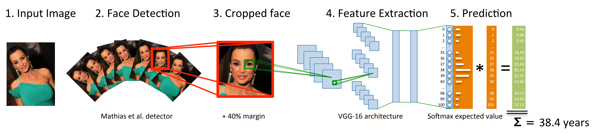
</div>

#### Advantages:

- _It predicts an exact number between 0 and 100 (depending on the data)._

#### Disadvantages:

- Misclassifications are treated equally, even though some age predictions may be more accurate than others.

### Extended binary classification: 
Extended binary classification also known as multiclass binary classification or one-vs-all classification, is an extension of the standard binary classification problem. In binary classification, the goal is to classify instances into one of two classesIn extended binary classification, the problem involves classifying instances into one of multiple classes, but each class is treated as an independent binary classification problem against all other classes combined.

#### Papers:

+ **Ordinal Regression(OR-CNN) _"Zhenxing Niu"_:** This approach transforms the ordinal regression task into multiple binary classification sub-problems. For each age value y<sub>k</sub>∈ Y, they construct a binary classifier to predict whether the true age y ∈ Y of a sample x ∈ X is larger than y<sub>k</sub> Their model network consists of 3 convolutional, 3 local response normalization, and 2 max-pooling layers followed by a fully connected layer with 80 neurons. they publish an Asian Face Age Dataset (AFAD) containing more than 160K facial images with precise age ground-truths, which is the largest public age dataset to date. Also achieves the state-of-the-art performance on both the MORPH and AFAD datasets in 2016.
  [[`Paper`](https://www.cv-foundation.org/openaccess/content_cvpr_2016/papers/Niu_Ordinal_Regression_With_CVPR_2016_paper.pdf)]

  <div align="center">
    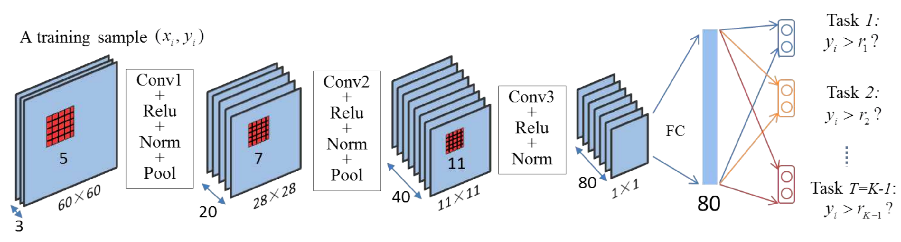
  </div>


+ **Rank consistent ordinal regression (CORAL) _"Wenzhi Cao"_:** modify extended binary classification approach by restricting the hypothesis class such that the binary classifier predictions are consistent, i.e., the predicted probabilities satisfy:   
**p(y > y<sub>k</sub>|x) ≥ p(y > y<sub>k+1</sub>|x); ∀k**   
Also They chose the ResNet-34 architecture for feature extracting.
  [[`Paper`](https://arxiv.org/pdf/1901.07884.pdf)]

<div align="center">
  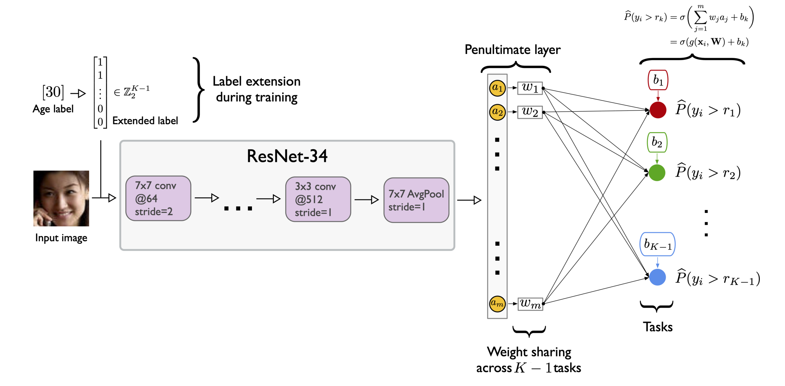
</div>

#### Advantages:

- _Unlike classification, where the labels just represent categories, ordinal regression utilizes labels that provide sufficient information to order the objects._

#### Disadvantages:

- _During prediction, each binary classifier needs to make a decision independently, and then the class with the highest confidence or probability is selected as the final prediction. This sequential process can become computationally expensive, especially when dealing with a large number of classes._

### Fixed distribution learning: 
Fixed Distribution Learning focuses on optimizing machine learning models for a predetermined data distribution, prioritizing performance within that specific context. It's valuable for domains where data distribution remains stable, like facial age estimation in spacefic dataset, but might sacrifice adaptability to new distributions.

#### Papers:

+ **Deep Label Distribution Learning (DLDL) _"Bin-Bin Gao"_:** this approach the task as multi-class classification. However, they encode the label distribution as a normal distribution centered at the true label **.** this method also effectively utilizes the label ambiguity in both feature learning and classifier learning, which help prevent the network from over-fitting even when the training set is small. In DLDLv2 they tried to minimize the difference between (i) the true label y ∈ Y, and (ii) the expectation E<sub>yˆ∼f(x)</sub> [y^] of the model output distribution f(x).
  [[`V1 Paper`](https://arxiv.org/pdf/1611.01731.pdf)]
  [[`V2 Paper`](https://arxiv.org/pdf/2007.01771.pdf)]

<div align="center">
  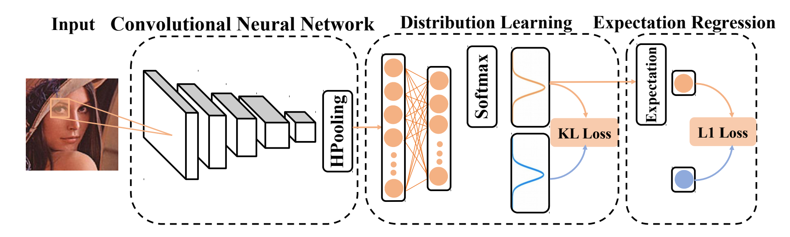
</div>

+ **Soft labels for ordinal regression (SORD) _" Amit Marathe"_ :** This approach the task similarly, but encodes the label distribution as a double exponential distribution centered at the true label.
  [[`Paper`](https://openaccess.thecvf.com/content_CVPR_2019/papers/Diaz_Soft_Labels_for_Ordinal_Regression_CVPR_2019_paper.pdf)]

#### Advantages:

- _This approach can achieve optimal performance within a well-defined and stable data distribution._

#### Disadvantages:

- _It involves statistical complexities and can be challenging to understand and implement._

- _This approach might not be effective for new or different data distributions._

### Adaptive distribution learning: 
this approach emerging in recent years is not to model a specific distribution, such as normal or double exponential distribution, but instead, to constrain the model by some statistical measure or a condition.

#### Papers:

+ **Mean-Variance _"Hongyu Pan"_:** this approach the task as standard multi-class classification, but design a loss function that (i) minimizes the squared difference between the expectation E<sub>yˆ∼f(x)</sub> [y^] and the true label y ∈ Y, and (ii) minimizes the variance E<sub>y¯∼f(x)</sub> (y¯ − E<sub>yˆ∼f(x)</sub> [y^])<sup>2</sup> of the model output distribution f(x).
  [[`Paper`](https://openaccess.thecvf.com/content_cvpr_2018/papers/Pan_Mean-Variance_Loss_for_CVPR_2018_paper.pdf)]

  <div align="center">
    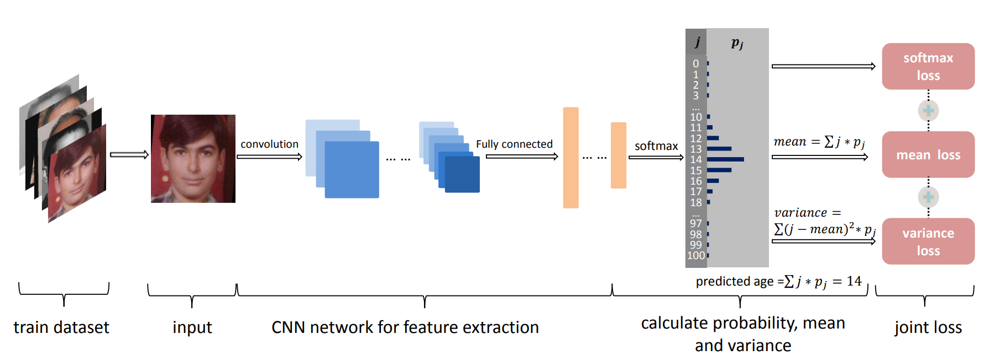
  </div>

+ **Adaptive Mean-Residue Loss _"Ziyuan Zhao"_:** in this paper they design an adaptive entropy-based residue loss, which can penalize the age probabilities out of dynamic top-K. By combining mean loss with residue loss, we proposed a simple, yet very efficient loss, adaptive mean-residue loss, for facial age estimation. They say _"If it is hard to extract deeper facial features, why not suppress uncorrelated features and dynamically penalize the residue to strengthen the correlation among the top-K classes indirectly?"_. Experimental results are superior to the existing state-of-the-art benchmarks, e.g., mean-variance loss.
  [[`Paper`](https://arxiv.org/pdf/2203.17156v1.pdf)]
  [[`Code`](https://github.com/jacobzhaoziyuan/AMR-Loss)]

  <div align="center">
    
  </div>

#### Advantages:

- _Adaptive Distribution Learning, as opposed to Fixed Distribution Learning, is its capability to handle changing or diverse data distributions._
- _Adaptive models can automatically adjust and evolve to new data patterns, making them more robust in dynamic real-world scenarios where distribution shifts occur._
- _They also can achieve optimal performance like_ fixed distribution learning.

#### Disadvantages:

- _It involves statistical complexities and can be challenging to understand and implement._
- _This approach is the potential for overfitting to temporary or noisy fluctuations in data distributions._

### Transformer Based Architecture: 
Transformer-based architectures, originally designed for natural language processing, have been successfully adapted for vision tasks. Models like Vision Transformers (ViTs) break down images into sequences of patches, treating them as "words" to be processed. This approach enables self-attention mechanisms to capture long-range dependencies, enhancing the model's ability to understand image context. Transformer-based architectures have achieved state-of-the-art results in tasks such as image classification, object detection, and segmentation by leveraging their parallel processing and attention mechanisms.

#### Papers:

+ **Multi-input Transformer(MiVOLO) _"Maksim Kuprashevich"_ :** MiVOLO is Transformer-based architectures that has pair input(face, rest of the body). For each input pair of size 224 × 224, we independently apply the original VOLO patch embedding module, which tokenizes the crops into image patches of size 8 × 8. Two representations are then fed into a feature enhancer module for cross-view feature fusion, which is achieved using cross-attention. Once the features are enriched with additional information, we perform a simple concatenation, followed by a Multi-Layer Perceptron (MLP) that creates a new fused joint representation and reduces the dimensionality of the features. This feature fusion allows us to pay attention to important features from both inputs and disregard less significant ones. Additionally, it handles scenarios where one of the inputs is empty, ensuring meaningful information is extracted even from a single view. they chose the VOLO model because it converges quickly and requires less data in experience. Additionally, VOLO is one of the fastest transformer-based vision models. Also they compare model's age recognition performance with human-level accuracy and demonstrate that it significantly outperforms humans across a majority of age ranges. This model is state-of-the-art in lots of tasks.
  [[`Paper`](https://arxiv.org/pdf/2307.04616.pdf)]
  [[`Code`](https://github.com/WildChlamydia/MiVOLO/tree/main)]

  <div align="center">
    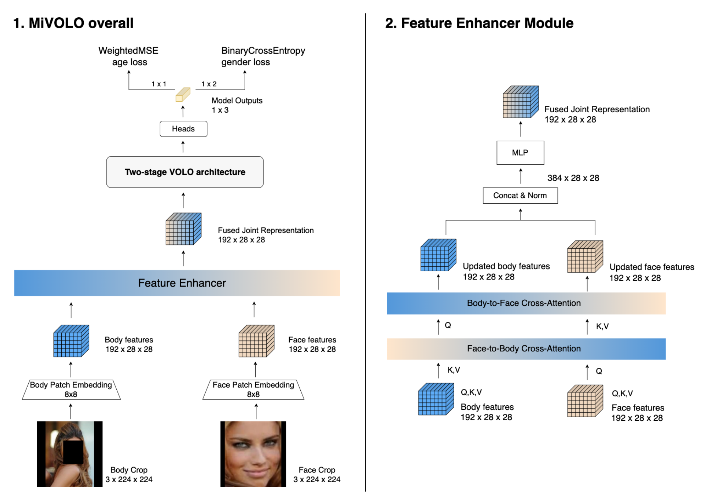
  </div>
  
#### Advantages:

- _This approach is very powerful and has achieved state-of-the-art performance in numerous tasks._

#### Disadvantages:

- _The requirement for extensive computational resources during both training and inference could present challenges for real-time or resource-constrained applications._
--------------------------------------------------------
## Our method:

### Model and Optimizer
In this work, we employed a simple regression approach. Our model's backbone consists of a fine-tuned ResNet50, followed by a fully connected layer with 100 output classes. While we explored alternative backbones like MobileNet, EfficientNet B0, and ResNet with FPN, ResNet50 consistently achieved the best loss.

For optimization, we initially employed SGD, which resulted in a loss of 4.7. Subsequently, we switched to Adam optimization, which improved our results, yielding a loss of 4.55.

### Data
Our model was trained on the UTKFace dataset, chosen due to its wide adoption in the research community, facilitating comparisons with existing work. However, we rigorously evaluated our best model on the CACD2000 dataset, where we achieved a Mean Absolute Error (MAE) loss of 10.

  <div align="center">
    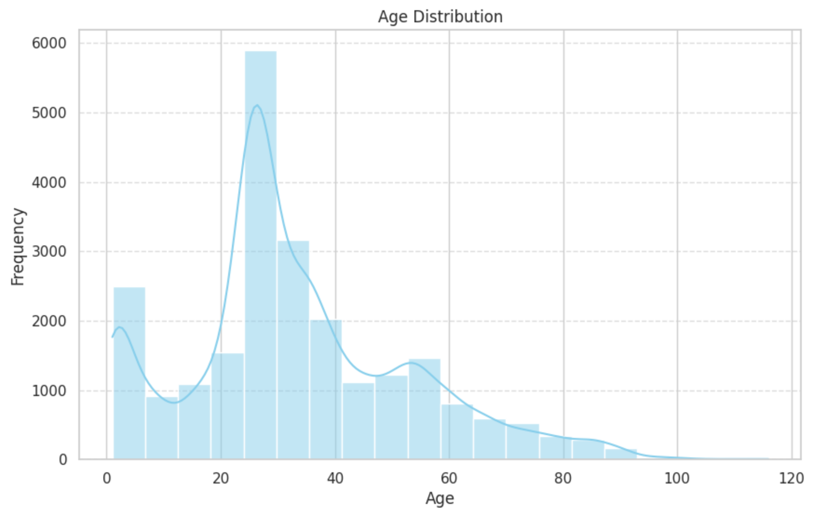
  </div>

  <div align="center">
    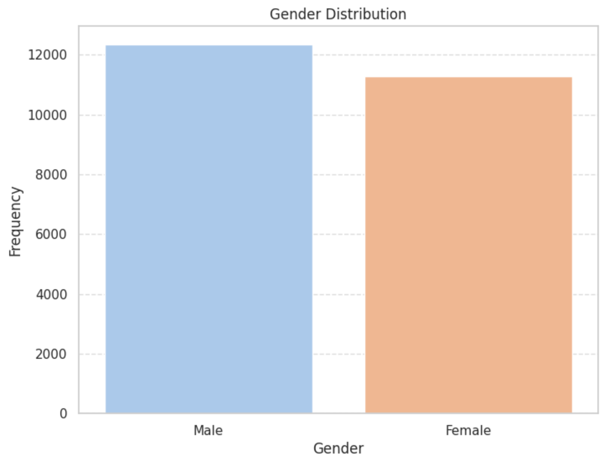
  </div>

  <div align="center">
    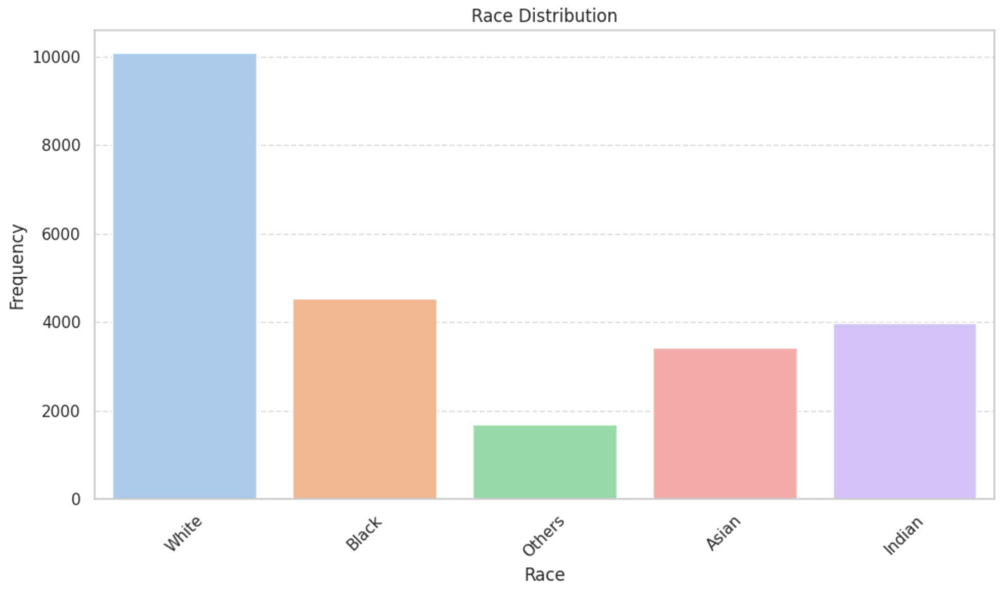
  </div>

After further fine-tuning our best model for 10 epochs on the CACD dataset, we achieved a loss of 8 on the CACD test set and 5 on the UTKFace dataset.

  <div align="center">
    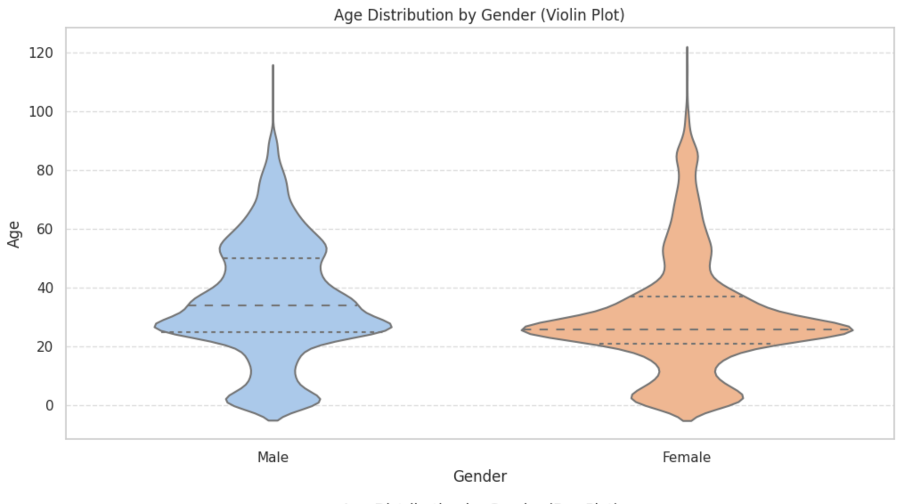
  </div>

  <div align="center">
    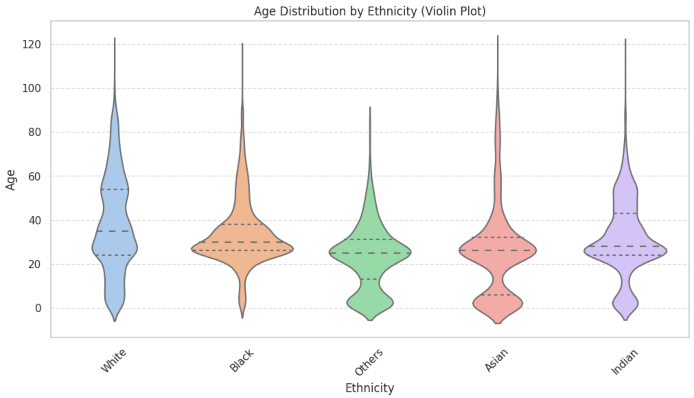
  </div>

### Experiment
The results of our experiments are presented below:

  <div align="center">
    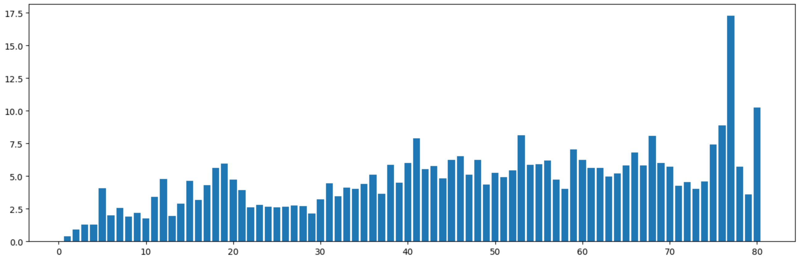
    The mean error per age group
  </div>

  <div align="center">
    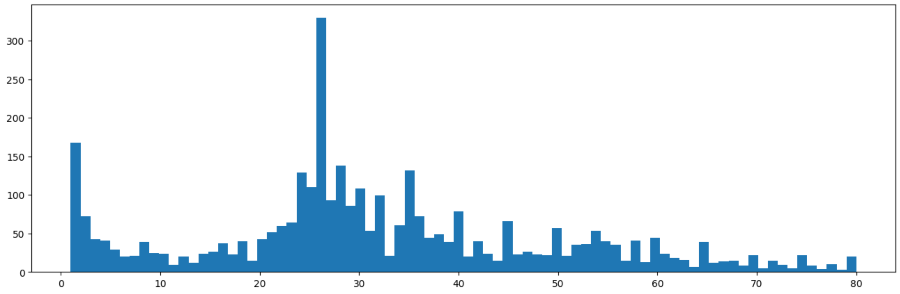
    The number of images per age group
  </div>

---------------------------------------------------------------
## Model Limitations
Please keep in mind that the image analysis model has some limitations, which can affect its accuracy. Due to these limitations, the model may not always provide perfect predictions for age, gender, and race. Despite efforts to address these challenges during development and training, achieving high accuracy in such predictions is a complex task influenced by various factors.

- Incorrect Labels in the Dataset: The dataset used to train the model may contain some incorrect or inaccurate labels. As a result, there might be instances where the predicted age, gender, or race may not accurately represent the actual attributes of the person in the image.

- Challenges with Gender Detection for Babies: Detecting the gender of babies (under 7 years old) can be challenging due to the limited development of gender-specific physical characteristics at an early age. The model may have difficulty accurately determining the gender for this age group.

- Difficulty Distinguishing Black People from Indian and White People from Others: The model may face challenges when distinguishing between individuals of different races, particularly when it comes to distinguishing black people from Indian people or white people from others. These races may exhibit similarities in certain facial features, leading to potential misclassifications.

- Dependence on Training Data: The accuracy of the age, gender, and race predictions heavily relies on the quality and diversity of the training data used. If the training data is not representative of all age groups, genders, and races, the model's performance may be limited in accurately predicting these attributes.

## Contributing

Contributions to this project are welcome! If you encounter any issues or have suggestions for improvements, please [open an issue](https://github.com/ARHPA/facial-age-estimation/issues/new). If you would like to contribute code, please fork the repository and submit a pull request.
Please note that the final part of the project, related to experiments, is not yet complete and is open for contributions as well. Your input and contributions are valuable in enhancing this project. Thank you for considering contributing!
